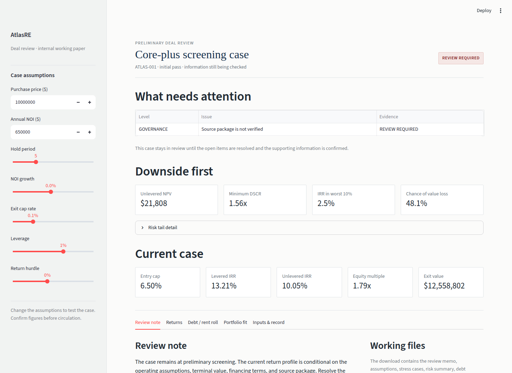
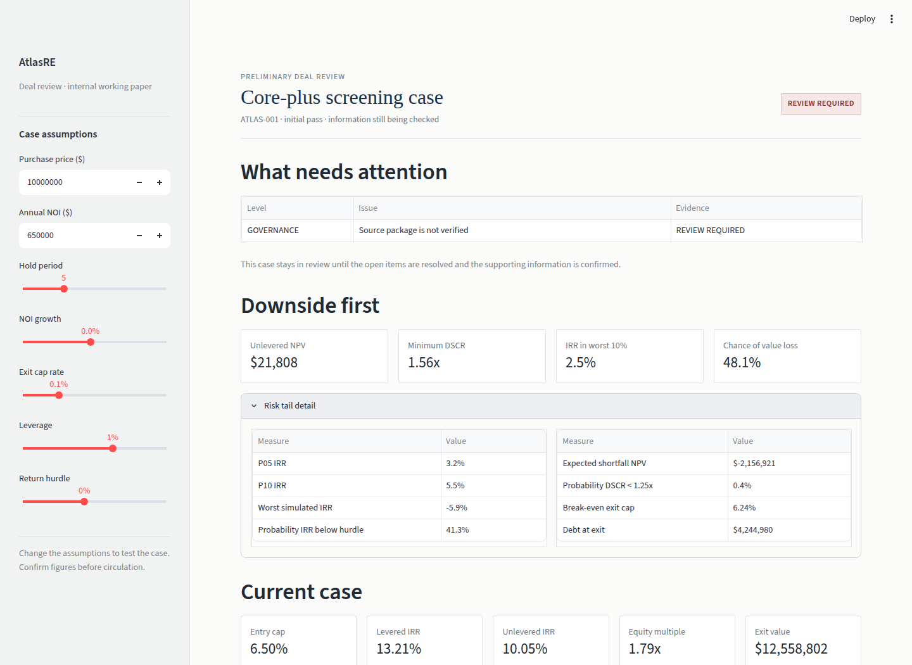
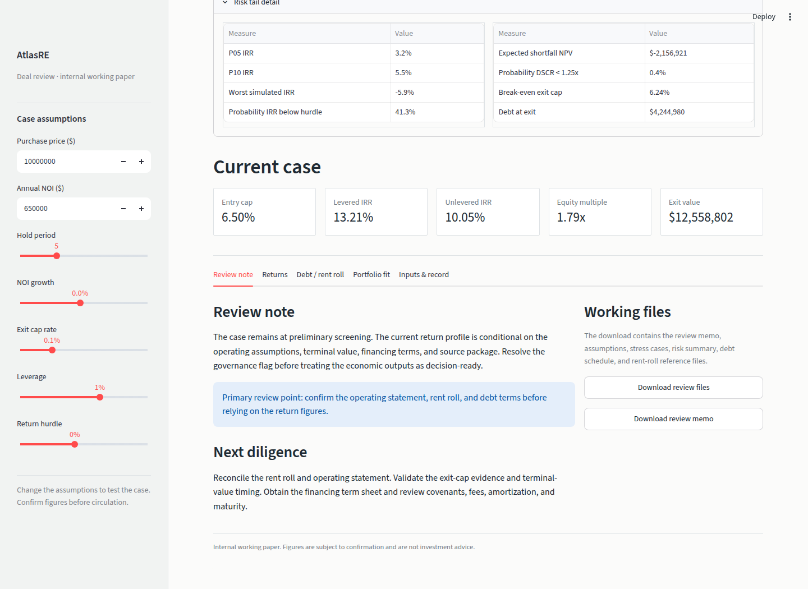

# AtlasRE Investment Intelligence

[](https://github.com/hossiendehghan989/atlasre-investment-intelligence/actions/workflows/ci.yml)

AtlasRE is a Python and Streamlit prototype for reviewing illustrative real-estate acquisition cases. Given explicit assumptions, it calculates annual acquisition cash flows, debt schedules, stress cases, selected risk summaries, and source-aware screening flags. It is decision support for a human reviewer; it is not an approval system, valuation opinion, or investment advice.

## Quickstart

```bash
python -m pip install -r requirements.txt
python -m pip install -r requirements-test.txt
python -m pytest -q
ruff check .
streamlit run dashboard.py
```

The dashboard runs locally. The report generator writes a package under `artifacts/`:

```bash
python generate_committee_report.py
```

All bundled inputs are illustrative unless a caller supplies and verifies source-backed data. The default screening case is intentionally marked `REVIEW REQUIRED`.

## Screenshots

The screenshots below were captured from the local Streamlit application with the default illustrative inputs.

| View | Screenshot |
| --- | --- |
| Decision summary |  |
| Downside and risk detail |  |
| Review package controls |  |

## Capabilities

| Area | Implemented behavior | Main boundary |
| --- | --- | --- |
| Acquisition | Annual NOI, growth, exit value, IRR, NPV, equity multiple, and DSCR | No asset-specific operating model, tax model, or valuation opinion |
| Market screen | Normalized market score and risk-adjusted ranking | No live data or calibrated market forecast |
| Debt | Monthly interest, amortization, IO, draws, balloon, DSCR, and LTV/DSCR sizing | No full debt stack, hedge, refinance, or loan-document covenant model |
| Development | Monthly draws, contingency, capitalized interest, stabilization, and exit | No contract budget, change-order, or cost-to-complete control |
| Waterfall | Return of capital, preferred return, ordered hurdles, promotes, and reconciliation | No legal-document mapping, clawbacks, or tax distributions |
| Lease foundation | Rent roll, escalation, vacancy, rollover, monthly NOI, expiry flags, and optional NOI bridge | No TI/LC, recoveries, capex, full downtime, or tenant-credit evidence |
| Risk | Named stress cases, seeded simulation, percentile tails, expected shortfall, and loss probabilities | No historical probability calibration |
| Governance | Assumption register, lineage, source status, and deterministic run ID | No persistent approval ledger, RBAC, or retention service |
| Portfolio | Capital allocation, DSCR eligibility, concentration diagnostics, and exposure view | `portfolio_exposure` remains a documented naive legacy screen; constrained allocation is in `src/portfolio.py` |

## Repository layout

```text
src/atlasre.py                 acquisition underwriting and market scoring
src/debt.py                    monthly debt schedules and debt sizing
src/advanced_underwriting.py   stress cases, simulation, and risk summaries
src/institutional.py           development schedules and waterfalls
src/lease.py                   rent-roll foundation
src/governance.py              assumptions, lineage, and run fingerprints
src/ic_workflow.py             screening flags, comparison, and memo generation
src/portfolio.py               constrained allocation and portfolio diagnostics
dashboard.py                  Streamlit interface
generate_committee_report.py  Markdown/CSV/JSON/ZIP package generator
tests/                        regression, adversarial, and independent checks
docs/                         audit, case study, architecture, and screenshots
```

## Modeling conventions

The core acquisition model treats the supplied annual NOI as year-one NOI; growth is applied from year two onward. Acquisition and selling costs are percentage assumptions. Exit value is terminal NOI divided by exit cap rate. Debt is modeled as a single amortizing loan with monthly payment mechanics. Portfolio exposure in `src/atlasre.py` is intentionally a naive score-weighted screen; the constrained allocator is separate. See [ATLASRE_ARCHITECTURE.md](ATLASRE_ARCHITECTURE.md) for the complete simplification inventory.

## Case study

See [docs/case_study.md](docs/case_study.md) for one worked **ILLUSTRATIVE** case, including assumptions, outputs, screening flags, and independent numerical checks. It is not a real transaction.

## Limitations

AtlasRE does not ingest live market data or source documents. It does not provide OCR, accounting, tax, FX, complete commercial lease economics, construction-to-permanent debt, mezzanine or preferred-equity stacks, refinance modeling, persistent approvals, production identity and access controls, or a multi-period fund optimizer. The simulation is seeded and reproducible but is not calibrated to observed market outcomes.

A deployment would require source-controlled ingestion, document and calculation reconciliation, independent model validation, persistent governance, formal authorization, monitoring, and firm-specific policies. No output should be circulated as an investment recommendation without those controls.

## Testing

The local branch currently passes **51 tests**. The suite covers acquisition math, debt, development, waterfalls, leases, governance, portfolio behavior, adversarial inputs, the market-risk correction, year-one NOI timing, equity contributions, and independent IRR/NPV/debt cross-checks. CI runs `pytest -q` and `ruff check .` on pushes and pull requests.

## License

MIT. See [LICENSE](LICENSE).
